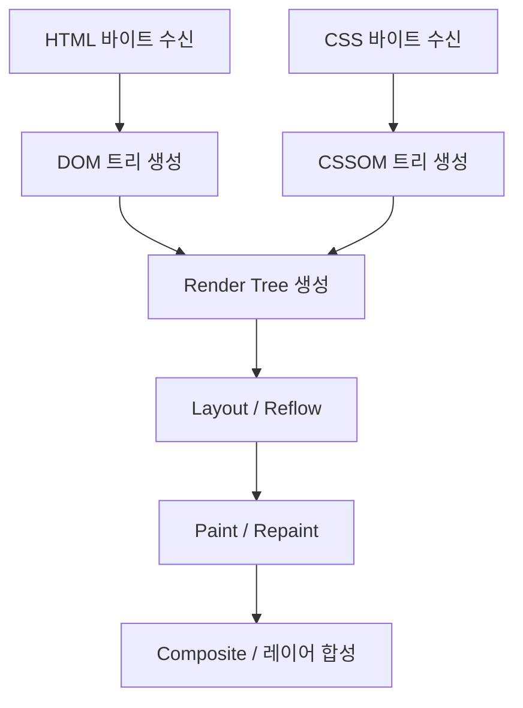

# 📌 Chapter 1: 브라우저 렌더링 원리 (CRP & Rendering Flow)

웹 브라우저가 HTML, CSS, JavaScript를 로드하여 화면에 그리는 과정과 성능 최적화의 첫걸음인 **CRP(Critical Rendering Path, 중요 렌더링 경로)**를 명확하게 이해하는 것이 렌더링 성능 튜닝의 시작점입니다.

---

## 1. 중요 렌더링 경로 (Critical Rendering Path, CRP)

중요 렌더링 경로(CRP)는 브라우저가 HTML, CSS, JS를 수신한 후 화면에 픽셀로 변환하기까지의 6단계 프로세스입니다.



### ① DOM (Document Object Model) 트리 생성
* 브라우저는 HTML 바이트 데이터를 받아 문자로 변환한 뒤, 토큰화를 거쳐 노드 객체들로 이루어진 **DOM 트리**를 구축합니다. 
* 이 과정은 HTML 문서의 끝에 도달할 때까지 순차적으로 진행됩니다.

### ② CSSOM (CSS Object Model) 트리 생성
* HTML 파싱 중 `<link rel="stylesheet">`나 `<style>` 태그를 만나면, CSS 파일을 요청하고 다운로드하여 **CSSOM 트리**를 구성합니다. 
* CSSOM은 스타일의 상속 규칙을 표현하므로, 전체가 파싱되기 전까지는 렌더링이 블로킹됩니다(**Render-blocking**).

### ③ 렌더 트리 (Render Tree) 구축
* DOM의 루트 노드부터 시작하여 화면에 **실제로 표시되는** 노드만 순회하며 CSSOM 정보를 매칭해 **렌더 트리**를 생성합니다. 
* `display: none;`이 지정된 노드는 렌더 트리에 포함되지 않으며, `visibility: hidden;`이나 `opacity: 0;`은 레이아웃에 자리를 차지하므로 렌더 트리에 포함됩니다.

### ④ 레이아웃 (Layout / Reflow)
* 렌더 트리의 각 노드들이 화면의 어느 위치에, 어떤 크기로 배치될지 기하학적 형태(Geometry)를 계산하는 과정입니다. 
* 뷰포트(Viewport) 크기에 비례하여 상대적인 값(`%` 등)이 절대적인 픽셀(`px`)값으로 결정됩니다.

### ⑤ 페인트 (Paint / Repaint)
* 레이아웃이 완료되면 브라우저는 각 노드들을 화면의 실제 픽셀로 그립니다. 
* 텍스트, 색상, 테두리, 그림자 등 모든 시각적 요소가 포함되며, 효율적인 화면 그리기를 위해 브라우저는 요소를 여러 레이어로 쪼개어 그리게 됩니다.

### ⑥ 합성 (Composite)
* 나누어 생성된 각각의 레이어들을 순서에 맞게 하나로 병합하여 모니터 화면에 최종 출력합니다. 
* GPU(그래픽 장치)가 이 연산을 주로 담당하여 처리 속도가 매우 빠릅니다.

---

## 2. Repaint와 Reflow 줄이기

브라우저 화면에 변경이 생기면 이미 거친 CRP 단계를 다시 수행해야 합니다. 이때 어떤 속성을 바꾸느냐에 따라 연산 비용이 완전히 다릅니다.

> [!IMPORTANT]
> * **Reflow (레이아웃 재계산):** 요소의 크기, 위치, 마진, 패딩, 폰트 크기 등이 변경될 때 발생합니다. 자식 노드의 레이아웃 계산이 부모 노드나 주변 노드까지 도미노처럼 영향을 주기 때문에 CPU 연산 비용이 매우 큽니다.
> * **Repaint (재페인팅):** 요소의 레이아웃 기하학적 형태는 바뀌지 않고, 배경색, 글자 색상, 테두리 색상, `box-shadow` 등 시각적 스타일만 변경될 때 발생합니다. Reflow보다는 저렴하지만 여전히 픽셀을 다시 그리는 비용이 듭니다.

### 📊 Repaint / Reflow 유발 대표 속성 대조표

| 구분 | 유발 요소 / 속성 |
| :--- | :--- |
| **Reflow + Repaint** | `width`, `height`, `padding`, `margin`, `border`, `position`, `top`, `left`, `font-size`, `line-height`, `float`, `box-sizing` 등 |
| **Repaint Only** | `color`, `background-color`, `border-style`, `border-radius`, `visibility`, `text-shadow`, `box-shadow` 등 |
| **No Reflow, No Repaint (Composite Only)** | `transform`, `opacity`, `cursor` 등 (GPU 하드웨어 가속 활용 가능) |

애니메이션이나 화면의 동적인 이동이 빈번하게 일어나는 요소는 가능한 `top`, `left` 등의 좌표 변경(Reflow 발생)을 피하고, GPU 합성 단으로 처리를 넘겨주는 `transform` 및 `opacity` 등을 적용하여 렌더링 성능을 획기적으로 개선할 수 있습니다.

---

## 3. Layout Shift (CLS) 피하는 법

### 1) Cumulative Layout Shift (CLS) 란?
* 사용자가 웹페이지를 읽거나 상호작용하는 중에, 예기치 않게 화면 요소의 레이아웃이 급격하게 움직이거나 밀려나는 현상의 누적 점수입니다. Lighthouse 및 Core Web Vitals의 중요 사용자 경험 지표 중 하나입니다.
* 주로 이미지가 늦게 로딩되거나 동적 컴포넌트(배너, 모달 등)가 마운트되면서 기존 본문 영역이 아래로 밀려내려가 오클릭을 유발하여 결제 등 치명적인 실수를 낳을 수 있습니다.

### 2) CLS의 주된 발생 원인과 Vue 최적화 해결책

#### ① 이미지 및 미디어의 `width` / `height` 속성 누락
* 과거에는 반응형 웹을 만들기 위해 `width: 100%; height: auto;`만 CSS로 선언하고 HTML 태그의 `width`/`height` 속성을 아예 생략했습니다.
* 이 경우 브라우저는 이미지가 로드되기 전에 해당 영역의 높이를 **0px**로 잡았다가, 로딩 완료 후에 급격히 영역을 확보하므로 큰 CLS가 유발됩니다.
* 해결 방법은 HTML 태그에 가로세로비를 명시하는 것입니다.

```html
<!-- ❌ CLS 유발 안티패턴 -->

<style>
.responsive-hero { width: 100%; }
</style>
```

```html
<!-- ⭕ CLS 해결 (Aspect Ratio 미리 확보) -->

<style>
.responsive-hero { width: 100%; height: auto; } /* 비율 자동 계산 */
</style>
```

#### ② 동적으로 삽입되는 UI 콘텐츠 공간 미확보
* Vue 환경에서 API 데이터 fetching 결과에 따라 광고 배너나 알림바를 화면 상단에 `v-if` 조건부 렌더링으로 띄우면, 렌더링되는 순간 전체 본문 콘텐츠가 아래로 밀려납니다.
* 이를 방지하려면 배너가 자리할 부모 컨테이너에 미리 **최소 높이(min-height)**를 주거나, 데이터 수신 전에 뼈대 레이아웃(Skeleton)을 배치해 자리를 확보해야 합니다.

```html
<!-- ❌ v-if 데이터 응답 후 급격한 밀림 -->
<div class="banner-area">
  <AdBanner v-if="bannerData" :info="bannerData" />
</div>
```

```html
<!-- ⭕ min-height 확보 및 스켈레톤 대처 -->
<div class="banner-area" style="min-height: 100px;">
  <AdBanner v-if="bannerData" :info="bannerData" />
  <SkeletonBanner v-else />
</div>
```

#### ③ 웹 폰트 로딩 시 폰트 교체
* 사용자 지정 웹 폰트(Web Font) 파일 다운로드가 완료될 때 기본 시스템 폰트에서 지정 웹 폰트로 교체되면서 줄바꿈 위치가 어긋나며 레이아웃이 튈 수 있습니다. 이에 대한 대책은 에셋 및 네트워크 단에서 해결하며, 뒷단 챕터에서 다룹니다.

