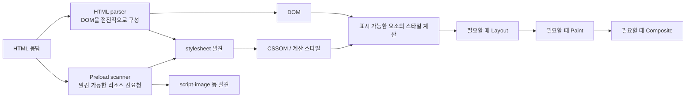

# 📌 Chapter 1: 브라우저 렌더링 원리 (CRP & Rendering Flow)

프론트엔드 성능 개선은 "어떤 코드가 느린가"보다 **브라우저가 지금 어떤 일을 해야 하는가**를 이해하는 데서 시작합니다. HTML 파싱, 리소스 발견, JavaScript 실행, Style·Layout·Paint·Composite는 한 번만 직렬로 끝나는 여섯 단계가 아닙니다. 문서를 읽는 동안 서로 겹치고, 화면 변경마다 필요한 부분만 다시 실행됩니다.

이 장에서는 첫 화면과 사용자 상호작용에서 브라우저가 거치는 흐름을 정리합니다. LCP·INP·CLS의 정의와 측정 기준은 [Chapter 7](./chapter-7-web-vitals-measurement.md)~[Chapter 9](./chapter-9-vue-nuxt-web-vitals.md)에서 다룹니다.

---

## 1. 중요 렌더링 경로를 "흐름"으로 이해하기

### 1) HTML parser와 preload scanner

브라우저는 HTML 응답을 모두 받은 뒤에 시작하지 않습니다. 바이트가 도착하는 대로 HTML parser가 토큰을 읽어 DOM을 **점진적으로** 만들고, 별도의 preload scanner가 아직 파서가 도달하지 않은 마크업에서도 일부 `link`, `script`, `img` 같은 리소스를 미리 발견해 요청할 수 있습니다.



* DOM은 HTML 끝에서 한 번 완성되는 정적 결과물이 아닙니다. JavaScript가 DOM을 추가·삭제하면 이후 렌더링 작업도 달라집니다.
* CSS는 일반적으로 첫 Paint를 지연시킬 수 있지만, CSS 파일을 만났다는 이유만으로 HTML parser가 항상 멈추는 것은 아닙니다. 다만 선행 stylesheet는 JavaScript 실행을 기다리게 할 수 있으므로 결과적으로 파싱·렌더링을 늦출 수 있습니다.
* preload scanner는 빠른 발견을 돕는 최적화일 뿐입니다. JavaScript 실행 뒤에야 만들어지는 URL, 조건부 API 응답, CSS 내부의 일부 리소스까지 모두 해결하지는 못합니다.

### 2) script 속성이 파싱과 실행 순서를 바꾸는 방식

다음 표는 외부 스크립트를 기준으로 한 실무적인 선택 기준입니다. 실제 우선순위와 네트워크 완료 시점은 연결 상태와 브라우저에 따라 달라지므로, 중요한 경로는 Trace와 Network 패널에서 확인해야 합니다.

| 마크업 | 다운로드 | 실행 시점과 순서 | 적합한 경우 |
| :--- | :--- | :--- | :--- |
| `<script src>` | parser가 만난 뒤 요청 | 다운로드·실행 동안 HTML parser를 막을 수 있음 | 초기 문서가 실행 전 반드시 준비돼야 하는 짧은 스크립트 |
| `<script defer src>` | 파싱과 병렬 다운로드 | 문서 파싱 후, 선언 순서를 유지하며 실행 | 앱 bootstrap처럼 DOM 준비 뒤 실행해도 되는 기본 스크립트 |
| `<script async src>` | 파싱과 병렬 다운로드 | 준비되는 즉시 실행, 선언 순서 보장 없음 | 서로 독립적인 분석·광고·위젯 스크립트 |
| `<script type="module">` | 의존 모듈도 함께 요청 | 기본적으로 `defer`와 유사하게 파싱 후 실행 | ESM 기반 애플리케이션 진입점 |

`defer`와 module script도 실행 시점의 스타일시트·의존성 상태를 고려해야 합니다. 반대로 순서 의존 코드에 `async`를 붙이면 간헐적인 초기화 오류가 생길 수 있습니다. Nuxt 4 앱의 route·component 분할은 [Chapter 4](./chapter-4-loading-patterns.md)에서, SSR과 Hydration의 실행 비용은 [Chapter 9](./chapter-9-vue-nuxt-web-vitals.md)에서 이어서 다룹니다.

### 3) 모든 화면 변경이 같은 비용을 내지는 않는다

화면의 픽셀을 바꾸는 경로는 보통 아래 다섯 종류의 작업으로 나뉩니다.

1. **JavaScript**: 이벤트 처리, 상태 변경, DOM 변경처럼 시각적 갱신의 원인을 만듭니다.
2. **Style**: 어떤 CSS 규칙이 각 요소에 적용되는지 계산합니다.
3. **Layout**: 요소의 크기와 위치라는 기하 정보를 계산합니다.
4. **Paint**: 글자, 색, 그림자, 이미지 등을 픽셀로 그립니다.
5. **Composite**: 여러 그리기 결과를 올바른 순서로 화면에 합성합니다.

| 변경 종류 | 흔히 필요한 경로 | 예시 | 주의할 점 |
| :--- | :--- | :--- | :--- |
| 기하 정보 변경 | Style → Layout → Paint → Composite | `width`, `margin`, `top`, 글자 크기 | 영향 범위가 넓으면 주변 요소도 다시 배치됨 |
| 시각 효과만 변경 | Style → Paint → Composite | `color`, `background`, `box-shadow` | Layout은 건너뛰어도 큰 영역 Paint는 비쌀 수 있음 |
| 합성만으로 가능한 변경 | Style → Composite일 수 있음 | 일부 `transform`, `opacity` 애니메이션 | 레이어 생성·raster 비용 때문에 항상 보장되지는 않음 |

> [!IMPORTANT]
> `transform`과 `opacity`를 "무조건 GPU 가속, 무조건 Composite only"로 외우면 위험합니다. 요소의 크기, 필터, 겹침, 브라우저의 레이어 판단에 따라 Paint나 raster 작업이 생길 수 있습니다. 변경 전후 Performance Trace에서 Layout·Paint·Composite 이벤트를 비교하는 것이 정답입니다.

---

## 2. 파싱과 첫 화면을 불필요하게 막지 않기

### 1) CSS와 JavaScript의 역할을 분리해 점검하기

첫 화면에 필요한 CSS는 빨리 발견되고 내려와야 합니다. 반면 사용자가 나중에 열 기능의 JavaScript와 스타일을 초기 HTML에 모두 넣으면, 다운로드뿐 아니라 CSSOM 생성·JS 파싱·실행 비용까지 앞당겨집니다.

| 확인 질문 | 문제가 될 수 있는 신호 | 우선 검토할 방향 |
| :--- | :--- | :--- |
| 첫 화면 CSS가 늦게 발견되는가? | CSS가 큰 JS 실행 뒤에 요청됨 | HTML의 stylesheet 순서, CSS `@import` 제거, 필요한 preload 검토 |
| 앱 진입 스크립트가 parser를 막는가? | 외부 classic script가 문서 상단에 있음 | `defer` 또는 module 여부와 초기화 의존성 검토 |
| 서드파티가 초기 작업을 차지하는가? | Trace의 Main에서 vendor 코드가 길게 보임 | 동의·사용자 행동 뒤 로드, route별 조건부 로드 |
| 첫 화면 밖 코드가 함께 도착하는가? | 초기 JS/CSS 전송량이 크고 Coverage가 낮음 | route·component 단위 분할, 실제 사용자 흐름으로 재검증 |

CSS의 `@import`는 해당 CSS를 받은 뒤에야 다음 파일을 발견하게 만들 수 있으므로, 독립적인 stylesheet는 보통 HTML의 `<link>`로 선언하는 편이 발견 시점에 유리합니다. 단, preload는 우선순위를 바꾸는 강한 힌트이므로 필요한 리소스에만 씁니다. 목적과 사용법은 [Chapter 4](./chapter-4-loading-patterns.md)에서 다룹니다.

### 2) "렌더 트리"는 표시 대상의 계산 결과로 보기

전통적인 설명의 Render Tree는 DOM과 CSSOM을 조합해 화면에 표시할 요소를 얻는 개념을 설명하는 데 유용합니다. 다만 개발자는 내부 자료구조 이름보다 다음 결과를 확인하는 편이 실용적입니다.

* `display: none` 요소는 박스를 만들지 않지만, `visibility: hidden`은 공간을 차지할 수 있습니다.
* `opacity: 0`은 보이지 않아도 Layout 공간과 이벤트 처리 여부가 남을 수 있습니다.
* 조건부 렌더링으로 대형 트리를 한 번에 추가하면 Vue의 Patch, Style, Layout, Paint가 같은 상호작용 뒤에 몰릴 수 있습니다.

```vue
<template>
  <button type="button" @click="isOpen = !isOpen">
    상세 필터 {{ isOpen ? '닫기' : '열기' }}
  </button>

  <FilterPanel v-if="isOpen" />
</template>

<script setup lang="ts">
import { ref } from 'vue';
import FilterPanel from './FilterPanel.vue';

const isOpen = ref(false);
</script>
```

위 코드가 문제가 되는 것은 `v-if` 자체가 아니라 `FilterPanel`의 크기, 초기 계산, 이미지, 서드파티 위젯이 한 클릭에 얼마나 많은 작업을 만드는지입니다. 먼저 DevTools Performance 녹화에서 그 클릭의 Interaction과 Main Thread를 확인한 뒤, 필요하면 비동기 컴포넌트·목록 가상화·작업 분할을 적용합니다.

---

## 3. Forced Synchronous Layout 피하기

### 1) 읽기와 쓰기를 섞으면 어떤 일이 생기는가

DOM 또는 클래스 변경은 Style/Layout을 "더러워진 상태"로 남겨 둘 수 있습니다. 그 직후 `offsetWidth`, `clientHeight`, `scrollTop`, `getBoundingClientRect()`처럼 최신 기하 정보가 필요한 값을 읽으면 브라우저는 값을 반환하기 전에 Style 또는 Layout을 즉시 계산할 수 있습니다. 이를 **forced synchronous layout**이라고 합니다.

`getComputedStyle()`도 속성과 현재 상태에 따라 Style 계산, 경우에 따라 Layout을 유발할 수 있습니다. 모든 읽기가 항상 느린 것은 아니지만, 많은 요소를 반복하면서 읽기와 쓰기를 교차하면 비용이 쉽게 커집니다.

```ts
// ❌ 요소마다 쓰기 → 읽기를 반복하면 재계산이 여러 번 발생할 수 있다.
for (const card of document.querySelectorAll<HTMLElement>('.card')) {
  card.classList.add('is-measuring');
  const height = card.getBoundingClientRect().height;
  card.style.setProperty('--measured-height', `${height}px`);
}
```

```ts
// ⭕ 먼저 필요한 값을 모두 읽고, 그 다음에 변경을 모아 적용한다.
const cards = [...document.querySelectorAll<HTMLElement>('.card')];
const heights = cards.map((card) => card.getBoundingClientRect().height);

cards.forEach((card, index) => {
  card.style.setProperty('--measured-height', `${heights[index]}px`);
});
```

### 2) Vue에서는 상태와 DOM 측정의 경계를 명확히 하기

Vue는 반응형 상태 변경을 묶어 DOM Patch를 예약합니다. 상태를 바꾼 직후 측정이 필요하면 `nextTick()`으로 해당 DOM 업데이트가 반영된 뒤에 읽고, 측정 결과를 다시 상태로 관리합니다. 직접 style을 반복 변경하는 방식은 최후의 수단으로 두는 편이 유지보수에 좋습니다.

```vue
<template>
  <section ref="panel" :style="{ '--panel-height': `${panelHeight}px` }">
    <button type="button" @click="toggleDetails">상세 보기</button>
    <p v-if="showDetails">비동기로 길어질 수 있는 상세 설명입니다.</p>
  </section>
</template>

<script setup lang="ts">
import { nextTick, ref } from 'vue';

const panel = ref<HTMLElement | null>(null);
const panelHeight = ref(0);
const showDetails = ref(false);

async function toggleDetails() {
  showDetails.value = !showDetails.value;
  await nextTick();
  panelHeight.value = panel.value?.getBoundingClientRect().height ?? 0;
}
</script>
```

이 예제는 측정이 정말 필요한 경우의 순서를 보여 줍니다. 클릭마다 높이가 필요 없다면 CSS의 자연스러운 레이아웃이나 `ResizeObserver`를 우선 검토하고, 실제 Trace에서 forced layout이 병목인지 확인합니다.

### 3) 애니메이션은 목표 속성부터 고르기

위치가 아니라 시각적 이동만 필요하다면 문서 흐름을 바꾸는 `top`/`left`보다 `transform`이 적합할 가능성이 큽니다. 사용자의 모션 감소 설정도 함께 존중합니다.

```css
.drawer {
  transform: translateX(100%);
  opacity: 0;
  transition: transform 180ms ease, opacity 180ms ease;
}

.drawer.is-open {
  transform: translateX(0);
  opacity: 1;
}

@media (prefers-reduced-motion: reduce) {
  .drawer {
    transition: none;
  }
}
```

`will-change`로 레이어를 미리 만드는 방법은 메모리와 raster 비용을 늘릴 수 있습니다. 긴 목록이나 지속적인 애니메이션에 전역 적용하지 말고, 필요한 짧은 구간에만 사용한 뒤 해제하는 전략은 [Chapter 5](./chapter-5-rendering-advanced.md)에서 다룹니다.

---

## 4. 레이아웃 안정성은 최종 공간을 먼저 예약하는 일

CLS의 점수·세션 윈도우·원인별 진단은 [Chapter 8](./chapter-8-core-web-vitals.md)에 있습니다. 이 장에서는 렌더링 관점의 한 가지 원칙만 기억하면 됩니다.

> **나중에 나타날 콘텐츠의 최종 크기 또는 종횡비를, 가능한 한 첫 Paint 전에 확보한다.**

```vue
<template>
  

  <section class="recommendation-slot">
    <RecommendationList v-if="isReady" :items="items" />
    <div v-else class="recommendation-skeleton" aria-hidden="true" />
  </section>
</template>

<script setup lang="ts">
import { ref } from 'vue';
import RecommendationList from './RecommendationList.vue';

const isReady = ref(false);
const items = ref<string[]>([]);
</script>

<style scoped>
.product-image {
  display: block;
  inline-size: 100%;
  block-size: auto;
}

.recommendation-slot,
.recommendation-skeleton {
  min-block-size: 160px; /* 실제 최종 카드 영역과 맞춰 검증한다. */
}
</style>
```

이미지의 `width`와 `height`는 반응형 CSS와 함께 사용해도 브라우저가 종횡비를 미리 계산하게 합니다. Skeleton·광고·iframe의 예약 높이는 임의의 최소값이 아니라 **실제 최종 크기**와 맞아야 합니다. Nuxt SSR 결과와 client Hydration 결과가 다르면 이 원칙을 지켜도 shift가 생길 수 있으므로, 해당 사례는 [Chapter 9](./chapter-9-vue-nuxt-web-vitals.md)를 함께 확인합니다.

### ✅ 렌더링 흐름 점검 체크리스트

* [ ] parser를 막는 classic script가 꼭 필요한 곳에만 있는가?
* [ ] `async` 스크립트에 실행 순서 의존성이 없는가?
* [ ] 첫 화면 CSS와 LCP 리소스가 초기 HTML에서 발견되는가?
* [ ] 대량 DOM 변경 뒤의 기하 정보 읽기를 반복하고 있지 않은가?
* [ ] 애니메이션의 실제 Layout·Paint 비용을 Trace에서 확인했는가?
* [ ] 이미지·동적 슬롯·embed의 최종 공간이 첫 Paint 전에 확보되는가?

### 📚 공식 참고 자료

* [브라우저 렌더링 성능과 Pixel Pipeline](https://web.dev/articles/rendering-performance)
* [Chrome DevTools Performance 패널](https://developer.chrome.com/docs/devtools/performance/reference/)
* [MDN: `<script>` 요소와 `async`·`defer`](https://developer.mozilla.org/en-US/docs/Web/HTML/Reference/Elements/script)
* [MDN: `getBoundingClientRect()`](https://developer.mozilla.org/en-US/docs/Web/API/Element/getBoundingClientRect)
* [Web.dev: CLS 최적화](https://web.dev/articles/optimize-cls)
