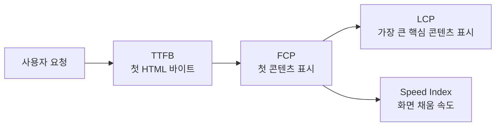
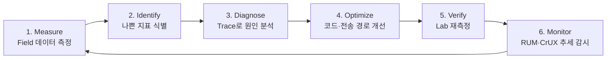

# 📌 Chapter 7: Web Vitals와 웹 성능 측정 전략 (Lab & Field Data)

웹 성능을 단순히 “페이지가 빨리 열린다”는 감각으로만 판단하면 실제 사용자가 겪는 문제를 놓치기 쉽습니다. **Web Vitals**는 로딩, 상호작용, 화면 안정성처럼 사용자가 직접 체감하는 순간을 공통된 언어로 측정하여, 네트워크·메인 스레드·렌더링 병목을 우선순위화하도록 돕는 사용자 중심 성능 지표 체계입니다.

---

## 1. Web Vitals와 Core Web Vitals의 역할

### 1) Web Vitals가 등장한 배경과 사용자 경험

전송 용량이 작고 Lighthouse 점수가 높더라도, 첫 화면의 핵심 이미지가 늦게 나타나거나 버튼을 눌렀을 때 화면이 멈추거나 읽던 문장이 밀리면 사용자는 서비스를 느리다고 인식합니다. **Web Vitals**는 이처럼 브라우저 내부의 기술 지표를 사용자의 경험으로 연결하기 위해 만들어졌습니다.

* **Web Vitals**: 좋은 웹 경험을 설명하는 사용자 중심 지표들의 묶음입니다. FCP, TTFB, TBT처럼 원인을 찾는 보조 지표도 함께 활용합니다.
* **Core Web Vitals**: Web Vitals 중 모든 페이지에서 특히 중요하게 관리할 핵심 세 지표입니다. 구성은 시대에 따라 바뀔 수 있으며, **2026년 현재 LCP, INP, CLS**가 해당합니다.
* 지표 하나만 낮추는 것이 목적이 아닙니다. 사용자가 콘텐츠를 보고(LCP), 즉시 조작하고(INP), 안정적으로 읽는지(CLS)를 함께 개선해야 합니다.

### 2) Web Vitals / Core Web Vitals / Lighthouse의 차이

| 구분 | 의미 | 활용 목적 |
| :--- | :--- | :--- |
| **Web Vitals** | 사용자 경험을 설명하는 성능 지표 전체 | 문제를 폭넓게 관찰하고 진단 |
| **Core Web Vitals** | LCP, INP, CLS의 핵심 사용자 경험 지표 | 실제 사용자 경험의 우선순위 설정 |
| **Lighthouse** | 정해진 환경에서 페이지를 실행하는 자동 감사 도구 | Lab 환경에서 재현·원인 분석·회귀 방지 |

Lighthouse의 Performance 점수는 단일 Lab 실행을 종합한 점수일 뿐입니다. 따라서 **“Lighthouse 90점 = Core Web Vitals 통과”가 아닙니다.** Core Web Vitals의 실제 평가는 다양한 사용자의 경험 분포, 특히 75번째 백분위수(P75)를 기준으로 판단해야 합니다.

### 3) SEO와 Core Web Vitals의 관계

Google 검색의 핵심 순위 시스템은 좋은 페이지 경험과 관련된 여러 신호를 사용하며, Core Web Vitals도 그중 하나입니다. 그러나 좋은 점수만으로 검색 상위 노출이 보장되지는 않습니다. 콘텐츠의 관련성·유용성·모바일 사용성·보안 등도 함께 평가되므로, Web Vitals는 **사용자 경험을 개선하면서 검색 성과에도 기여할 수 있는 기술 품질 기준**으로 이해해야 합니다.

> [!IMPORTANT]
> SEO 점수만을 위해 지표를 인위적으로 맞추기보다, 실제 사용자가 가장 먼저 보는 콘텐츠와 가장 자주 수행하는 작업을 빠르고 안정적으로 만드는 것이 우선입니다.

---

## 2. Core Web Vitals와 보조 성능 지표 읽기

### 📊 Core Web Vitals 핵심 지표 기준

아래 기준은 페이지 로드의 **P75**에서 모바일과 데스크톱을 각각 나누어 판단하는 것이 원칙입니다. 세 지표가 모두 Good이어야 Core Web Vitals 평가를 통과한 것으로 봅니다.

| 지표 | 사용자 경험 | Good | 개선 필요 | Poor |
| :--- | :--- | :--- | :--- | :--- |
| **LCP** | 핵심 콘텐츠가 보이는 로딩 경험 | **≤ 2.5s** | > 2.5s ~ ≤ 4.0s | > 4.0s |
| **INP** | 입력 후 다음 화면 갱신까지의 반응성 | **≤ 200ms** | > 200ms ~ ≤ 500ms | > 500ms |
| **CLS** | 예기치 않은 화면 밀림의 안정성 | **≤ 0.1** | > 0.1 ~ ≤ 0.25 | > 0.25 |

### 1) TTFB, FCP, Speed Index의 로딩 흐름

| 지표 | 의미 | Web Vitals와의 연결 |
| :--- | :--- | :--- |
| **TTFB** | 요청 시작부터 HTML 첫 바이트를 받을 때까지의 시간 | 높은 TTFB는 FCP와 LCP가 출발하는 시점을 함께 뒤로 미룹니다. |
| **FCP** | 텍스트·이미지 등 첫 콘텐츠가 처음 그려진 시점 | 빈 화면이 끝난 시점을 보여 주며, LCP가 늦는 원인을 분리하는 데 유용합니다. |
| **Speed Index** | 로딩 중 화면이 시각적으로 채워지는 속도 | Lighthouse의 Lab 지표이며, 화면 전체의 진행감을 보조적으로 설명합니다. |
| **TBT** | Lighthouse 탐색의 FCP와 TTI 사이 Long Task 50ms 초과 구간 합계 | Lab에서 메인 스레드가 막힌 정도를 찾아 **INP 문제의 단서**를 얻습니다. |
| **FID** | 첫 입력이 처리되기 시작할 때까지의 지연 | 첫 입력의 대기 시간만 보았으므로 **2024년 3월 INP로 대체**되었습니다. |

`TTFB → FCP / LCP` 관계는 단순합니다. 서버 응답이 늦으면 브라우저는 HTML을 파싱하거나 핵심 리소스를 발견할 수 없으므로 이후의 모든 Paint가 늦어집니다. 반대로 TTFB가 빠르더라도 큰 이미지 다운로드, JavaScript 실행, 렌더링 차단 CSS 때문에 LCP는 여전히 나빠질 수 있습니다.

TBT와 INP는 같은 값이 아닙니다. TBT는 통제된 페이지 로드 구간에서 Long Task를 찾는 **Lab 진단 지표**이고, INP는 실제 방문 중 클릭·탭·키 입력이 다음 Paint로 이어지는 전체 지연을 측정하는 **Field 중심 지표**입니다.

---

## 3. Lab Data와 Field Data의 차이

### 1) Synthetic Monitoring과 Lab Data

**Lab Data**는 정해진 기기 성능·네트워크·위치에서 스크립트로 페이지를 실행해 얻는 재현 가능한 측정값입니다. Lighthouse, Lighthouse CI, 정기적인 Synthetic Monitoring이 여기에 속합니다.

* 코드 변경 전후를 동일한 조건에서 비교하기 쉽습니다.
* DevTools Trace와 함께 사용하면 네트워크 폭포수, Long Task, Layout Shift의 직접 원인을 빠르게 재현할 수 있습니다.
* 단일 기기와 보통의 cold load를 가정하므로, 실제 모든 사용자 경험을 대표하지는 않습니다.

### 2) CrUX와 RUM 기반 Field Data

**Field Data**는 실제 사용자의 기기, 네트워크, 지역, 캐시 상태, 상호작용을 반영해 수집한 측정값입니다. 사이트가 JavaScript로 직접 계측하는 방식은 **RUM(Real User Monitoring)**이고, Chrome 사용자의 경험을 공개적으로 집계한 대표 Field Data가 **CrUX**입니다.

* **CrUX(Chrome UX Report)**: 실제 Chrome 사용자 경험을 집계한 공개 데이터셋입니다. 제공 경로에 따라 집계 기간이 다르며, PageSpeed Insights·Search Console·CrUX API는 최근 **28일**을 반영합니다. BigQuery 데이터셋과 CrUX Dashboard는 월 단위 집계도 제공하므로 배포 직후 즉시 개선 여부가 보이지 않습니다.
* **자체 RUM**: 서비스가 `web-vitals` 라이브러리 등을 페이지에 넣어 직접 수집하는 데이터입니다. 로그인 여부, 화면 종류, LCP 요소, 느린 상호작용 대상처럼 CrUX보다 더 세밀하게 분류할 수 있습니다.
* CrUX는 Chrome 사용자 기반이고 충분한 트래픽이 없는 URL은 데이터가 없을 수 있습니다. 이때 자체 RUM이 특히 중요합니다.

| 구분 | Lab Data | Field Data (RUM / CrUX) |
| :--- | :--- | :--- |
| 데이터 주체 | 가상·통제된 테스트 | 실제 사용자 |
| 환경 | 고정된 기기, 네트워크, 위치 | 기기 성능, 캐시, 지역, 행동이 모두 다름 |
| 강점 | 재현성, 원인 추적, CI 회귀 감지 | 실제 경험과 P75 분포 확인 |
| 한계 | 실제 사용 패턴을 놓칠 수 있음 | 수집량·집계 지연이 있고 원인 Trace가 부족할 수 있음 |
| 우선 역할 | **Diagnose / Verify** | **Measure / Identify / Monitor** |

### 3) Lighthouse 결과와 실제 사용자 성능이 다른 이유

두 결과가 다르다고 해서 어느 한쪽이 틀린 것은 아닙니다. 다음 차이를 먼저 확인해야 합니다.

* 실제 사용자는 저사양 기기, 느린 네트워크, 먼 지역, 광고 차단 여부, 로그인 상태, A/B 테스트, 동의 배너를 각기 다르게 경험합니다.
* 재방문 사용자는 JS·이미지·폰트가 캐시되어 있을 수 있지만, Lighthouse는 대체로 새 방문자의 cold load를 측정합니다.
* INP와 로드 이후 CLS는 사용자의 클릭·스크롤·동적 콘텐츠에 따라 달라집니다. 아무 상호작용을 하지 않는 Lighthouse 탐색만으로는 완전히 재현하기 어렵습니다.
* PageSpeed Insights의 URL 단위 Lab 결과와 origin 단위 CrUX 데이터처럼, 비교한 모집단과 URL 범위가 다를 수도 있습니다.

> [!WARNING]
> Lab 결과가 좋아도 Field P75가 나쁘다면 실제 사용자에게 발생하는 조건을 RUM으로 분류해야 합니다. 반대로 Field가 나쁘다는 사실만 보고 추측으로 코드를 수정하지 말고, Lab Trace로 재현 가능한 병목을 찾아야 합니다.

---

## 4. 성능 도구별 역할과 분석 Workflow

### 1) 도구별 역할 구분

| 도구 | 주 데이터 | 가장 적합한 역할 |
| :--- | :--- | :--- |
| **Chrome DevTools** | 로컬 Trace / 실시간 실행 | Performance 패널에서 LCP 요소, Main Thread, Rendering, Layout Shift를 깊게 추적 |
| **Lighthouse** | Lab Data | 감사 항목, TBT, 렌더링 차단 리소스, 회귀 테스트 |
| **PageSpeed Insights** | CrUX Field + Lighthouse Lab | 공개 URL의 Field 상태와 Lab 개선 제안을 한 화면에서 확인 |
| **CrUX** | Chrome Field Data | URL·origin 단위의 실제 사용자 분포와 장기 추세 확인 |
| **Search Console** | CrUX Field Data | 소유 사이트의 유사 URL 그룹별 Core Web Vitals 상태 확인 |
| **`web-vitals` 라이브러리** | 자체 RUM | Core Web Vitals 값을 콜백으로 측정해 전송을 구현하고, 서비스 코드에서 사용자·화면 맥락을 추가 |

`web-vitals`의 기본 build는 지표 값을 수집합니다. LCP 요소, 느린 INP 상호작용 대상, 큰 CLS 대상처럼 원인을 찾을 진단 정보는 `web-vitals/attribution` build를 사용해 함께 전송합니다.

### 2) Measure → Identify → Diagnose → Optimize → Verify → Monitor

1. **Measure**: PageSpeed Insights, Search Console, 자체 RUM으로 실제 사용자 P75와 URL/기기별 분포를 확인합니다.
2. **Identify**: LCP·INP·CLS 중 어느 지표가 나쁜지, 어느 페이지 템플릿과 사용자군에 집중되는지 구분합니다.
3. **Diagnose**: Chrome DevTools Performance 패널로 문제를 재현합니다. LCP는 Network와 LCP 요소, INP는 Interaction/Long Task와 Main Thread, CLS는 Layout Shift 항목과 영향을 받은 노드를 확인합니다.
4. **Optimize**: 서버 응답, 리소스 우선순위, Vue 렌더링, Nuxt Hydration, 레이아웃 예약 중 실제 병목에 해당하는 부분만 수정합니다.
5. **Verify**: 같은 조건에서 Lighthouse와 DevTools Trace를 다시 실행해 예상한 구간이 줄었는지 검증합니다.
6. **Monitor**: 배포 뒤 자체 RUM과 CrUX의 Field 데이터를 계속 관찰합니다. CrUX는 집계 지연이 있으므로, 배포 직후에는 자체 RUM을 더 빠른 신호로 사용합니다.

### 📚 공식 참고 자료

* [Web Vitals 개요와 기준](https://web.dev/articles/vitals)
* [Google Search의 Page Experience와 Core Web Vitals](https://developers.google.com/search/docs/appearance/page-experience)
* [Core Web Vitals 도구별 Workflow](https://web.dev/articles/vitals-tools)
* [Lab Data와 Field Data가 다른 이유](https://web.dev/articles/lab-and-field-data-differences)
* [Chrome UX Report (CrUX) API](https://developer.chrome.com/docs/crux/api)
