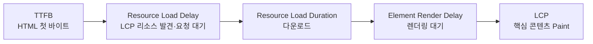
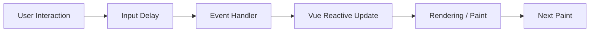

# 📌 Chapter 8: Core Web Vitals 심화 분석 (LCP, INP & CLS)

Core Web Vitals는 서로 독립된 점수처럼 보이지만 실제로는 하나의 브라우저 렌더링 흐름 위에서 움직입니다. LCP는 **서버·네트워크·렌더링 시작 시점**, INP는 **메인 스레드와 JavaScript 실행**, CLS는 **레이아웃이 확정되기 전후의 화면 변화**를 드러냅니다. 따라서 점수만 보고 처방하지 말고, 어떤 브라우저 단계가 병목인지부터 분해해야 합니다.

---

## 1. LCP (Largest Contentful Paint)와 로딩 경험

### 1) LCP가 측정하는 것과 Candidate 결정 과정

**LCP**는 탐색 시작(Navigation Start)부터 초기 뷰포트 안의 가장 큰 의미 있는 콘텐츠가 화면에 그려질 때까지의 시간입니다. 보통 히어로 이미지, 포스터 이미지가 있는 비디오, 큰 제목·본문 텍스트 블록이 후보가 됩니다.

브라우저는 Paint가 발생할 때마다 현재까지 가장 큰 후보를 `largest-contentful-paint` 항목으로 갱신합니다. 이후 더 큰 이미지나 텍스트가 그려지면 후보가 바뀔 수 있으며, 최초 탭·클릭·스크롤·키 입력 뒤에는 새 후보 보고가 멈춥니다. 즉 LCP는 “모든 리소스 다운로드 완료 시점”이 아니라 **사용자가 처음 보는 화면에서 가장 큰 콘텐츠가 실제 Paint된 시점**입니다.

| 확인 항목 | LCP가 아닌 경우 |
| :--- | :--- |
| `img`, CSS 배경 이미지, 비디오 포스터, 큰 텍스트 블록 | 화면 밖의 큰 이미지, SVG 전체, 뒤늦게 보이는 하단 콘텐츠 |
| 초기 뷰포트에서 실제로 그려진 크기 | 원본 파일의 해상도나 DOM 상의 단순 크기 |
| 가장 최근의 가장 큰 Candidate | 처음으로 Paint된 작은 로고나 스피너 |

### 2) LCP 4단계 분해: 어디에서 시간이 사라지는가



LCP는 다음 네 구간의 합입니다. 구간은 서로 겹치거나 비지 않으므로, 개선 전후에는 **전체 LCP와 각 구간을 함께** 비교해야 합니다.

| 구간 | 무엇을 뜻하는가 | 나빠지는 대표 원인 | 우선 개선 방향 |
| :--- | :--- | :--- | :--- |
| **TTFB** | 요청부터 HTML 첫 바이트까지 | 느린 서버 렌더링·DB·원거리 서버·캐시 미스 | CDN/edge 캐시, 서버 연산·API 병렬화, SSG |
| **Resource Load Delay** | TTFB 뒤 LCP 리소스 요청 전까지 | JS가 나중에 이미지를 삽입, CSS 배경 이미지, `loading="lazy"` | 초기 HTML에서 `src` 발견, preload, 적절한 우선순위 |
| **Resource Load Duration** | LCP 리소스 자체 다운로드 시간 | 큰 원본, 느린 전송, 대역폭 경합 | 반응형 이미지, WebP/AVIF, CDN·캐시 |
| **Element Render Delay** | 다운로드 뒤 실제 Paint까지 | 렌더링 차단 CSS, 큰 JS·Hydration, Long Task, 숨김 처리 | Critical 경로 JS/CSS 축소, SSR HTML, Main Thread 해제 |

LCP가 2.5초를 넘는다면 두 `Delay` 구간은 가능한 한 0에 가깝게 만드는 것이 좋은 출발점입니다. 다만 “TTFB 40%, 다운로드 40%” 같은 비율은 진단용 가이드일 뿐 절대 목표가 아닙니다. 예를 들어 이미지를 AVIF로 바꿔 다운로드가 빨라져도, Main Thread가 큰 JavaScript를 실행 중이면 줄어든 시간이 Element Render Delay로 옮겨가 LCP는 거의 변하지 않을 수 있습니다.

### 3) 이미지 LCP의 요청 우선순위와 전송 최적화

초기 뷰포트의 LCP 이미지에는 **lazy loading을 적용하면 안 됩니다.** 브라우저가 레이아웃을 어느 정도 계산한 뒤에야 요청을 시작하므로 Resource Load Delay를 스스로 늘리는 결과가 됩니다.

```html
<!-- ❌ 뷰포트 안 LCP 후보도 native lazy loading으로 요청을 미룸 -->
<section class="hero">
  
</section>
```

```html
<!-- ⭕ 초기 HTML에서 즉시 발견하고 높은 우선순위를 부여 -->
<head>
  <link
    rel="preload"
    as="image"
    imagesrcset="/images/hero-768.avif 768w, /images/hero-1440.avif 1440w"
    imagesizes="100vw"
    type="image/avif"
    fetchpriority="high"
  >
</head>
<body>
  <section class="hero">
    
  </section>
</body>
```

**문제점**

Client-side 렌더링으로 이미지 URL을 늦게 넣으면 preload scanner가 초기 HTML에서 이미지를 찾지 못합니다. 또한 LCP 이미지에 `loading="lazy"`를 쓰면 브라우저가 “나중에 필요할 리소스”로 판단해 요청을 미룹니다.

**개선 효과**

초기 HTML의 `src`/`srcset`은 이미지 요청을 빨리 시작하게 하고, `imagesrcset`/`imagesizes`를 가진 `preload`는 같은 반응형 선택 규칙으로 핵심 이미지를 선행 요청하게 합니다. `fetchpriority="high"`는 한 개 정도의 실제 LCP 이미지가 다른 비핵심 이미지 뒤로 밀릴 가능성을 낮춥니다. `width`와 `height`는 CLS도 방어합니다.

> [!WARNING]
> `preload`와 `fetchpriority="high"`를 여러 이미지·폰트·스크립트에 남용하면 한정된 네트워크 대역폭이 경쟁하여 정작 LCP가 늦어질 수 있습니다. Performance Trace와 Network Waterfall로 **실제 LCP Candidate 하나**를 먼저 확인한 뒤 적용해야 합니다.

이미지의 바이트를 줄이는 방법은 다음과 같습니다.

* 뷰포트와 `sizes`에 맞는 크기만 `srcset`으로 전송하고, 원본 크기를 그대로 보내지 않습니다.
* 사진 계열은 WebP 또는 AVIF를 우선 검토하되, 디코딩 비용과 화질을 실제 저사양 기기에서 확인합니다.
* 이미지 CDN과 장기 캐시는 전송 거리·캐시 미스·용량을 줄여 Resource Load Duration을 낮춥니다.
* 콘텐츠성 히어로 이미지는 CSS `background-image`보다 ``가 초기 HTML에서 더 빨리 발견되기 쉽습니다. 배경 이미지가 꼭 필요하다면 정확히 같은 URL을 `preload`해야 합니다.

### 4) Render Blocking과 SSR / SSG / CSR의 관계

외부 CSS는 CSSOM이 만들어질 때까지 렌더링을 막으며, 동기 Script와 큰 초기 JavaScript는 HTML 파싱·이미지 Paint·Hydration을 지연시킬 수 있습니다. 따라서 사용하지 않는 CSS를 줄이고, 초기 화면과 무관한 JS·제3자 Script를 늦추며, 긴 Main Thread 작업을 분리해야 합니다.

| 렌더링 방식 | LCP에 유리한 점 | 주의할 병목 |
| :--- | :--- | :--- |
| **SSR** | 서버 HTML에 제목·LCP 이미지 URL을 넣어 브라우저가 일찍 발견 | 데이터 대기·서버 연산이 TTFB를 늘릴 수 있음 |
| **SSG / Prerender** | 정적 HTML을 CDN에서 빠르게 내려 TTFB와 Resource Load Delay를 낮추기 쉬움 | 배포 주기·개인화 데이터 제약 |
| **CSR** | 서버 부담과 구현 복잡도를 줄일 수 있음 | JS 다운로드·파싱·실행 뒤에야 LCP DOM을 만들면 Delay가 길어짐 |

SSR과 SSG는 “항상 빠른” 기능이 아니라 **LCP 콘텐츠를 초기 응답에 넣을 기회**입니다. 서버가 느리거나 렌더링 차단 CSS와 Hydration 비용이 크면 LCP는 여전히 나쁠 수 있습니다.

**LCP 진단 순서**

1. PageSpeed Insights 또는 RUM에서 나쁜 URL과 LCP Candidate를 확인합니다.
2. DevTools Performance 패널에서 LCP 마커와 관련 DOM 노드를 선택합니다.
3. Network Waterfall에서 HTML TTFB, 이미지 요청 시작 시점, Priority, 다운로드 시간을 분리합니다.
4. 이미지가 완료된 뒤에도 늦다면 Main Thread의 Script·Style·Layout·Paint 작업과 Hydration을 확인합니다.

---

## 2. INP (Interaction to Next Paint)와 메인 스레드

### 1) INP는 어떤 상호작용을 어떻게 측정하는가

**INP(Interaction to Next Paint)**는 페이지 방문 전체에서 사용자가 클릭·탭·키보드 입력을 한 뒤, 그 결과가 다음 화면에 Paint될 때까지의 지연을 측정합니다. 스크롤·hover·zoom은 INP의 관찰 대상이 아닙니다. 상호작용이 전혀 없으면 INP 값도 보고되지 않습니다.



한 번의 탭은 `pointerdown`, `pointerup`, `click`처럼 여러 이벤트를 만들 수 있습니다. 브라우저는 이를 하나의 논리적 상호작용으로 묶고, 그 안의 이벤트 중 Input Delay·Processing Duration·Presentation Delay를 모두 포함한 전체 duration이 가장 긴 값을 해당 Interaction의 지연으로 봅니다. 상호작용이 적을 때는 대체로 가장 느린 Interaction이 INP가 되며, 50개 이상이면 우연한 이상치를 줄이기 위해 50개마다 가장 느린 값 하나를 제외합니다. 따라서 INP는 대략 최악에 가까운 고백분위수의 반응성을 나타냅니다.

| 구간 | 브라우저에서 일어나는 일 | 대표 병목 |
| :--- | :--- | :--- |
| **Input Delay** | 입력은 도착했지만 첫 Handler가 시작되기 전 | 이미 실행 중인 Long Task, Hydration, 제3자 JS |
| **Processing Duration** | Event Handler와 연결된 Callback 실행 | 무거운 필터·정렬·JSON 파싱·동기 API 호출 |
| **Presentation Delay** | Callback 종료 뒤 다음 프레임의 Style·Layout·Paint 대기 | 큰 DOM Patch, 강제 Reflow, 복잡한 CSS·Paint |

Vue에서는 Handler가 `ref`/`reactive` 상태를 바꾸고, 반응형 effect가 Virtual DOM Patch를 예약한 뒤, 브라우저가 Layout과 Paint를 수행합니다. 따라서 “Handler 함수는 짧다”는 사실만으로 INP가 좋다고 단정할 수 없습니다. 큰 `v-for` 목록이나 불안정한 Props 때문에 갱신 범위가 넓다면 Presentation Delay가 길어집니다.

### 2) FID가 INP로 대체된 이유

| 구분 | FID (과거) | INP (현재) |
| :--- | :--- | :--- |
| 관찰 범위 | 첫 번째 상호작용 1회 | 페이지 생애 전체의 클릭·탭·키 입력 |
| 측정 범위 | Handler가 시작할 때까지의 Input Delay | Input Delay + Processing Duration + Presentation Delay |
| 알 수 없던 문제 | 첫 클릭 뒤의 느린 검색·결제·메뉴, 화면 갱신 지연 | 실제 다음 Paint까지의 반응성 |
| Core Web Vitals 상태 | **2024년 3월 교체됨** | 현재 반응성 Core Web Vital |

FID는 첫 입력의 대기 시간만 측정했기 때문에, Handler가 500ms 동안 Main Thread를 점유하거나 화면이 늦게 Paint되는 문제를 놓쳤습니다. INP는 사용자가 페이지를 쓰는 동안의 대표적인 가장 느린 상호작용을 반영하므로, 전체 반응성을 더 정확하게 보여 줍니다.

### 3) Long Task, Vue 갱신, 무거운 Event Handler 진단

브라우저 Main Thread는 한 번에 하나의 Task를 실행합니다. **50ms를 넘는 Task는 Long Task**로 표시되며, 실행 중에는 새 입력을 처리하거나 다음 프레임을 Paint할 수 없습니다.

* 초기 번들의 Parse/Compile/Execute, Hydration, 태그 매니저·채팅 위젯 같은 제3자 Script는 Input Delay를 만듭니다.
* 클릭 Handler 안의 대량 배열 순회, 동기 JSON 파싱, 정렬, 차트 초기화는 Processing Duration을 키웁니다.
* 큰 Reactive State 변경, `watchEffect`의 광범위한 의존성, 수천 개의 DOM 노드 Patch, `offsetHeight`를 반복해서 읽고 쓰는 Layout Thrashing은 Presentation Delay를 키웁니다.

DevTools Performance 패널에서 느린 동작을 녹화한 뒤 Interaction 항목과 빨간 삼각형 Long Task를 찾습니다. 이어서 Bottom-Up / Call Tree에서 가장 긴 함수, Main Thread의 Scripting·Rendering·Painting 비중, Vue Devtools의 Component Update를 함께 확인하면 Vue 코드의 병목과 브라우저 작업을 연결할 수 있습니다.

### 4) Main Thread를 비우는 개선 패턴

**Code Splitting**은 초기 번들에 들어오는 JS를 줄여 Parse·Execute·Hydration 비용을 낮춥니다. 단, 클릭한 순간에 필요한 컴포넌트를 처음 다운로드하면 그 클릭의 INP가 나빠질 수 있으므로, hover·viewport 진입 등 의도가 보이는 시점에 미리 준비하거나 즉시 피드백을 먼저 보여야 합니다.

```typescript
type YieldingScheduler = {
  yield?: () => Promise<void>
};

function yieldToBrowser(): Promise<void> {
  const scheduler = (
    globalThis as typeof globalThis & { scheduler?: YieldingScheduler }
  ).scheduler;

  return scheduler?.yield?.()
    ?? new Promise<void>((resolve) => setTimeout(resolve, 0));
}

async function buildInChunks(items: readonly string[]) {
  for (let start = 0; start < items.length; start += 300) {
    buildSearchIndex(items.slice(start, start + 300));
    await yieldToBrowser();
  }
}
```

`scheduler.yield()`는 현재 Task의 나머지를 후속 Task로 보내 브라우저가 입력·렌더링을 처리할 기회를 줍니다. 아직 모든 주요 브라우저에서 안정적으로 사용할 수 있는 API는 아니므로 feature detection과 `setTimeout` fallback이 필요합니다. Task를 작게 나누는 것은 총 연산량을 없애는 방법이 아니라 **사용자의 입력이 기다리지 않도록 양보하는 방법**입니다.

* **Web Worker**: 필터링, 암호화, 대량 JSON 변환, 검색 인덱스처럼 DOM과 무관한 CPU 계산을 별도 스레드로 보냅니다. Worker는 Vue DOM을 직접 갱신할 수 없으므로 결과를 받은 뒤의 Patch 범위도 작게 유지해야 합니다.
* **`requestAnimationFrame`**: 다음 Paint 직전에 작은 시각 상태를 모으는 데 적합합니다. 무거운 필터·파싱을 rAF Callback 안에 넣으면 Paint 바로 전에 Main Thread를 막으므로 INP 개선책이 아닙니다.
* **즉시 피드백**: 버튼의 pending 상태·체크 상태처럼 가벼운 UI를 먼저 갱신하고, 비핵심 분석·저장은 다음 Task나 Worker로 넘깁니다.

---

## 3. CLS (Cumulative Layout Shift)와 시각적 안정성

### 1) Layout Shift와 CLS 계산 방식

**Layout Shift**는 이미 보이는 요소가 사용자의 의도 없이 위치를 바꾸는 현상입니다. CLS는 이 변화가 차지하는 면적과 이동 거리를 점수화합니다.

```text
개별 Layout Shift 점수 = Impact Fraction × Distance Fraction
CLS = 가장 큰 Session Window 안의 개별 점수 합
```

* **Impact Fraction**: 이전 프레임과 현재 프레임에서 불안정한 요소가 차지한 보이는 영역의 합집합을 뷰포트 면적으로 나눈 값입니다.
* **Distance Fraction**: 움직인 요소 중 가장 먼 이동 거리를 뷰포트의 더 긴 축으로 나눈 값입니다.
* **Session Window**: Shift 사이 간격이 1초 미만이고 전체 길이가 최대 5초인 묶음입니다. CLS는 페이지 생애 전체 합이 아니라 이 묶음 중 가장 큰 누적 점수입니다.

클릭·탭·키 입력 후 500ms 이내에 발생한 Shift는 사용자가 행동의 결과를 예상할 수 있다고 보아 CLS에서 제외될 수 있습니다. 그러나 네트워크 응답이 늦어 500ms를 넘거나, 스크롤·drag 뒤에 콘텐츠가 밀리면 제외되지 않습니다. 따라서 “사용자가 눌렀으니 공간 예약이 필요 없다”고 가정하면 안 됩니다.

### 2) 실제 Layout Shift 코드 비교

```vue
<!-- ❌ 이미지와 비동기 배너가 뒤늦게 높이를 차지 -->
<template>
  <main>
    
    <PromoBanner v-if="promotion" :promotion="promotion" />
    <article>{{ article.body }}</article>
  </main>
</template>

<style scoped>
.cover {
  width: 100%;
}
</style>
```

**문제점**

브라우저는 이미지가 내려오기 전 최종 높이를 알 수 없고, API 응답 뒤 `PromoBanner`가 본문 위에 추가되면 아래 콘텐츠가 밀립니다. 광고·iframe·embed도 같은 방식으로 늦게 높이가 정해지면 CLS를 유발합니다.

```vue
<!-- ⭕ 최종 비율과 배너 공간을 초기 Paint부터 예약 -->
<template>
  <main>
    

    <section class="promo-slot" aria-label="프로모션">
      <PromoBanner
        v-if="promotion"
        :promotion="promotion"
        class="promo-banner"
      />
      <div v-else class="promo-skeleton" aria-hidden="true" />
    </section>

    <article>{{ article.body }}</article>
  </main>
</template>

<style scoped>
.cover {
  display: block;
  width: 100%;
  height: auto;
}

.promo-slot {
  block-size: 96px;
}

.promo-banner,
.promo-skeleton {
  block-size: 100%;
}

.promo-skeleton {
  border-radius: 8px;
  background: #e5e7eb;
}
</style>
```

**개선 효과**

`width`와 `height`는 반응형 이미지에서도 브라우저가 종횡비를 먼저 계산하게 합니다. 예시의 `96px`처럼 **최종 배너와 정확히 같은 높이**의 slot과 Skeleton은 비동기 데이터, 광고, iframe이 준비되기 전에도 자리를 선점하므로 기존 본문이 이동하지 않습니다. 실제 서비스에서는 광고·embed의 예상 최종 크기 또는 `aspect-ratio`를 slot에 맞춰야 합니다.

### 3) 이미지·광고·폰트·애니메이션별 방어 전략

| 원인 | 왜 CLS가 생기는가 | 안정화 방법 |
| :--- | :--- | :--- |
| 이미지·비디오 | 로드 전 높이를 모름 | HTML `width`/`height`, CSS `aspect-ratio`, poster |
| 광고·iframe·embed | 광고 응답·외부 문서가 나중에 크기를 결정 | 예상 최대 공간 예약, 빈 슬롯의 급격한 collapse 방지 |
| 동적 콘텐츠 | `v-if`로 기존 콘텐츠 위에 새 노드를 삽입 | Skeleton, 고정 slot, 사용자 흐름상 아래에 추가 |
| 웹 폰트 | FOIT/FOUT 뒤 글꼴 폭·줄바꿈이 바뀜 | WOFF2·subset, preload 검토, fallback metric 일치 |
| 위치 애니메이션 | `top`·`left` 변경이 주변 Layout을 재계산 | `transform`, `opacity` 중심의 합성 애니메이션 |

**FOIT**는 웹 폰트가 준비될 때까지 텍스트가 보이지 않는 현상이고, **FOUT**는 fallback 폰트로 먼저 보였다가 웹 폰트로 바뀌는 현상입니다. `font-display: swap`은 FOIT를 줄이지만 글자 폭이 다른 fallback이면 FOUT에 따른 CLS가 생길 수 있습니다. 따라서 한글을 포함한 실제 문장으로 줄바꿈을 검증하고, `size-adjust`, `ascent-override`, `descent-override` 같은 fallback font metric 조정 또는 Nuxt Fonts의 metric fallback을 고려합니다.

```css
.embed-shell {
  width: 100%;
  aspect-ratio: 16 / 9;
  background: #f3f4f6;
}

.toast {
  position: fixed;
  inset-inline-end: 24px;
  inset-block-end: 24px;
  transition: transform 180ms ease, opacity 180ms ease;
}

.toast-enter-from,
.toast-leave-to {
  transform: translateY(12px);
  opacity: 0;
}
```

`transform`은 문서 흐름의 공간을 바꾸지 않아 `top`·`left`보다 Layout Shift와 Reflow를 피하기 좋습니다. 하지만 아직 공간이 없는 이미지·광고·embed에 `transform`만 적용해도 자리가 생기지는 않습니다. CLS의 근본 해결은 **최종 레이아웃 공간을 Paint 전에 확보하는 것**입니다.

**CLS 진단 순서**

1. DevTools Performance 녹화에서 Experience / Layout Shift 항목과 영향을 받은 노드를 확인합니다.
2. 해당 Shift가 이미지·폰트·광고·Hydration·비동기 `v-if` 중 무엇과 같은 시점에 발생하는지 Trace와 Network를 대조합니다.
3. 자체 RUM에서는 `web-vitals/attribution`의 `largestShiftTarget`을 함께 보내 Field에서 가장 자주 흔들리는 요소를 분류합니다.
4. 화면 크기, 느린 네트워크, 광고 미응답, 웹 폰트 캐시 미스 조건을 바꾸어 Skeleton과 예약 공간이 항상 유지되는지 검증합니다.

### 📚 공식 참고 자료

* [LCP 측정 방식](https://web.dev/articles/lcp)
* [LCP 4단계 분해와 최적화](https://web.dev/articles/optimize-lcp)
* [INP 측정 방식과 FID 차이](https://web.dev/articles/inp)
* [INP 최적화와 Main Thread](https://web.dev/articles/optimize-inp)
* [Long Task 분할](https://web.dev/articles/optimize-long-tasks)
* [CLS 계산 방식](https://web.dev/articles/cls)
* [CLS 최적화](https://web.dev/articles/optimize-cls)
